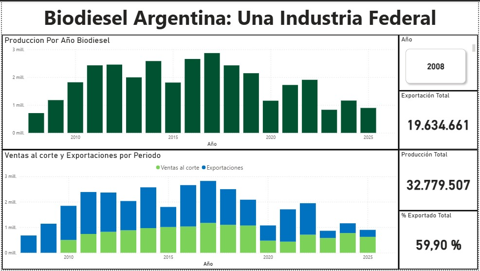

# Biodiesel-Argentina-Analytics
# 📊 Análisis de la Industria del Biodiesel en Argentina (2008-2025)

## 📝 Descripción del Proyecto
Este repositorio contiene un análisis integral realizado en **Power BI** sobre la evolución de la industria del biodiesel en Argentina. El estudio abarca desde los inicios de la industria hasta las proyecciones de 2025, analizando volúmenes de producción, mercado interno vs. exportación y distribución federal.

## 🖼️ Visualización del Dashboard

## 💡 Hallazgos Principales (Insights)
* **Perfil Exportador:** Argentina mantiene un promedio de exportación superior al **59%**, consolidándose como un actor clave en el mercado.
* **Estacionalidad:** Se detectó una concentración de producción entre los meses de mayo y octubre, coincidiendo con la zafra de oleaginosas.
* **Dominancia Federal:** La provincia de **Santa Fe** representa el núcleo productivo del país, concentrando la mayor parte de las plantas industriales.

## 🛠️ Herramientas y Técnicas Utilizadas
- **Power Query (M):** Limpieza de datos y transformación (*Unpivot*) de series temporales provinciales.
- **Modelado de Datos:** Relación de tablas y creación de calendario.
- **DAX:** Medidas de inteligencia de tiempo y KPIs dinámicos.

## 📁 Contenido del Repositorio
- `Biodiesel_Argentina.pbix`: Archivo original de Power BI.
- `estadisticas_biodiesel.xls`: Fuente de datos original.
